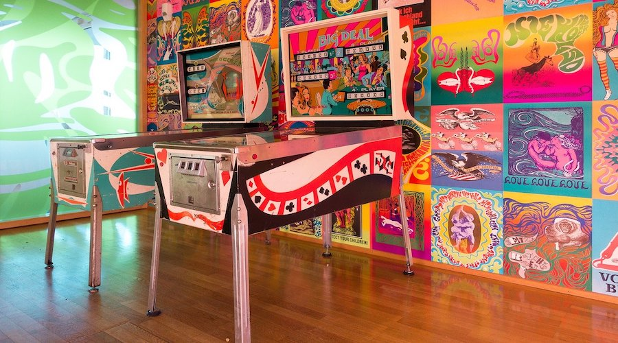
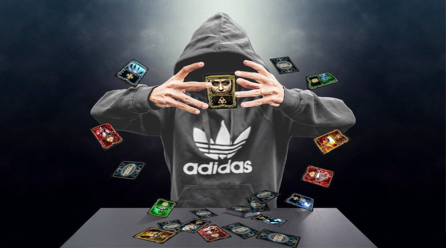

# Pinball
<figure>
    
    <figcaption>Ever since I was a young boy, I've played the silver ball...</figcaption>
</figure>

I've been getting into pinball quite a bit lately. While I don't currently own a machine, I like to use [Pinball Map](http://pinballmap.com/) to search for tables that I'm interested in playing. Personally, the arcade hunt also serves as a reason to travel and see more of the world. Two birds with one stone :)

I also play on simulators like The Pinball Arcade and Pinball FX3. The experience is not the same, but certainly much cheaper.

# Trading Card Games
<figure>
    
    <figcaption>Believe in the heart of the cards!</figcaption>
</figure>

Yu-Gi-Oh! was my introduction to the world of TCGs. (The anime had convinced me to learn how to play the actual game.) One of my first programming projects was a [calculator](https://gist.github.com/sudiamanj/c9dca4019559819a415b3aabae44cca5) that keeps track of life points for both players.

Nowadays, I mostly play Magic: The Gathering. I really enjoy the deck building aspect of TCGs, which inspired me to create [Combo Chance](http://combochance.sudicode.com) — a tool that calculates the probability of drawing a combo in an opening hand.
